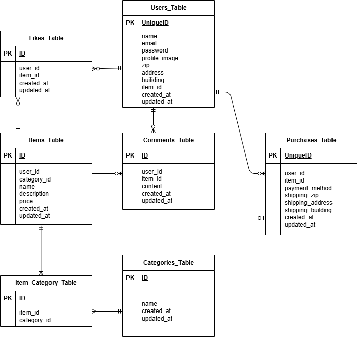

## アプリケーション名

## 環境構築
Docker Build
1. git clone git@github.com:hmgit-git/mogi1
2. docker-compose up -d --build
3. srcディレクトリにある「.env.example」をコピーして「.env」を作成し DBの設定を変更
4. phpコンテナにログイン docker-compose exec php bash
5. laravelのインストール composer install
6. アプリケーションキーを作成 php artisan key:generate
7. DBのテーブルを作成 php artisan migrate
8. mailhogのインストール　docker-compose.ymlにmailhog追記、.envに下記のように記載
MAIL_MAILER=smtp
MAIL_HOST=mailhog
MAIL_PORT=1025
MAIL_USERNAME=null
MAIL_PASSWORD=null
MAIL_ENCRYPTION=null
MAIL_FROM_ADDRESS=test@example.com
MAIL_FROM_NAME="coachtechフリマ"

9. サンプルユーザでログインする場合は下記をご使用ください
- サンプルユーザ１
ユーザ名：user1@example.com
パスワード：password
- サンプルユーザ２
ユーザ名：user2@example.com
パスワード：password
- サンプルユーザ３
ユーザ名：user3@example.com
パスワード：password

10. テスト用DBの作成
docker-compose exec mysql bash
mysql -u root -p
CREATE DATABASE demo_test;

テスト用設定ファイルを作成
cp .env .env.testing

テスト用設定ファイルを変更
APP_ENV=test
APP_KEY=
DB_CONNECTION=mysql_test
DB_HOST=mysql
DB_PORT=3306
DB_DATABASE=demo_test
DB_USERNAME=root
DB_PASSWORD=root

テスト用のAPP_KEYの作成とキャッシュクリア
docker-compose exec php bash
php artisan key:generate --env=testing
php artisan config:clear

テスト用DBのマイグレーション
php artisan migrate --env=testing

テストの実行
php artisan test

## 使用技術(実行環境)
1. PHP 8.0
2. Laravel 10.0
3. MySQL 8.0

## URL
・アプリケーション：http://localhost/ ・phpMyAdmin：http//localhost.8080/　・mailhog：http://localhost:8025/

## ER図

