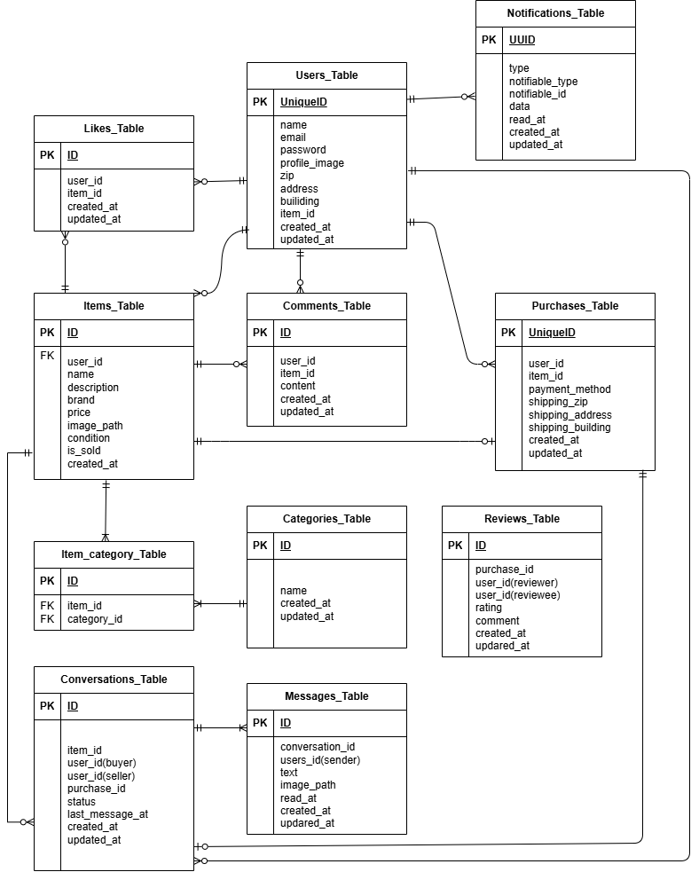

# アプリケーション名：coachtech 勤怠管理アプリ
# 環境構築
Docker Build
1. git clone git@github.com:hmgit-git/mogi02
2. docker-compose up -d --build
3. srcディレクトリにある「.env.example」をコピーして「.env」を作成し DBの設定を変更
  DB_CONNECTION=mysql
  DB_HOST=mysql
  DB_PORT=3306
  DB_DATABASE=laravel_db
  DB_USERNAME=laravel_user
  DB_PASSWORD=laravel_pass
4. phpコンテナにログイン docker-compose exec php bash
5. laravelのインストール composer install
6. アプリケーションキーを作成 php artisan key:generate
7. DBのテーブルを作成 php artisan migrate
8. ダミーデータの登録 php artisan db:seed
9. mailhogのインストール、.envに下記のように記載
  MAIL_MAILER=smtp
  MAIL_HOST=mailhog
  MAIL_PORT=1025
  MAIL_USERNAME=null
  MAIL_PASSWORD=null
  MAIL_ENCRYPTION=null
  MAIL_FROM_ADDRESS="no-reply@example.test"
  MAIL_FROM_NAME="coachtech 勤怠管理アプリ"
10. シンボリックリンクの作成 php artisan storage:link
11. "○○の保存に失敗しました。十分な権限がありません。[管理者権限で再試行] を選択して管理者として再試行してください。"エラーが発生した場合、ディレクトリに権限を設定 chmod -R 777 *
12. テスト用DBの作成
  docker-compose exec mysql bash
  mysql -u root -p
  CREATE DATABASE demo_test;
13. テスト用設定ファイルを作成 cp .env .env.testing
14. テスト用設定ファイルを変更
  APP_ENV=test
  APP_KEY=
  DB_CONNECTION=mysql_test
  DB_HOST=mysql
  DB_PORT=3306
  DB_DATABASE=demo_test
  DB_USERNAME=root
  DB_PASSWORD=root
15. テスト用のAPP_KEYの作成とキャッシュクリア
  docker-compose exec php bash
  php artisan key:generate --env=testing
  php artisan config:clear
16. テスト用DBのマイグレーション php artisan migrate --env=testing
17. テストの実行 php artisan test
18. サンプルユーザでログインする場合は下記をご使用ください
  - サンプルユーザ１
  一般ユーザ名：user1@example.com
  パスワード：password
  - サンプルユーザ２
  一般ユーザ名：user2@example.com
  パスワード：password
  - サンプルユーザ３
  一般ユーザ名：user3@example.com
  パスワード：password
  - サンプルユーザ４
  管理者ユーザ名：admin1@example.com
  パスワード：password
  - サンプルユーザ５
  管理者ユーザ名：admin2@example.com
  パスワード：password

# 使用技術(実行環境)
1. PHP 7.4.9
2. Laravel 8.83.8
3. MySQL 15.1
4. nginx 1.21.1
5. Laravel Fortify（会員登録・ログイン・パスワードリセット機能）
6. FormRequest（ログイン・会員登録・勤怠入力などのバリデーション）
# ルートファイル構成
本プロジェクトでは、ルート定義を用途別に分けています。
・ routes/web.php
一般ユーザー向けのルートを定義。
ログイン・会員登録・勤怠打刻など、通常ユーザーが利用する画面のルーティング。
・routes/admin.php
管理者向けのルートを定義。
/admin プレフィックス付きでアクセスし、auth:admin ミドルウェアが適用されます。
管理者ログイン後に利用可能な勤怠一覧、スタッフ管理、申請承認などの機能が含まれます。
# URL
・アプリケーション：http://localhost/ （一般ログイン: /login、管理者ログイン: /admin/login）・phpMyAdmin：http//localhost.8080/　・mailhog：http://localhost:8025/
# ER図

